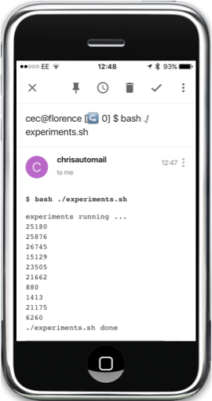

<h1>
  lmk - let me know
  <a href="https://badge.fury.io/py/lmk">
    
  </a> <a href="https://www.gnu.org/licenses/gpl-3.0.en.html" target="_blank">
    
  </a>
</h1>

Email notifications from the command line.

**Step 1** Wrap your long running job in `lmk`:

```sh
$ lmk 'bash ./experiments.sh'
...  # command runs and outputs normally
[lmk] chrisc.101@gmail.com notified
```

**Step 2** ☕

**Step 3** Receive an email when it's done:



## Installation
```sh
$ pip install lmk
```

## License

Made with ♥ by [Chris Cummins](http://chriscummins.cc). Released under [MIT License](https://tldrlegal.com/license/mit-license).
