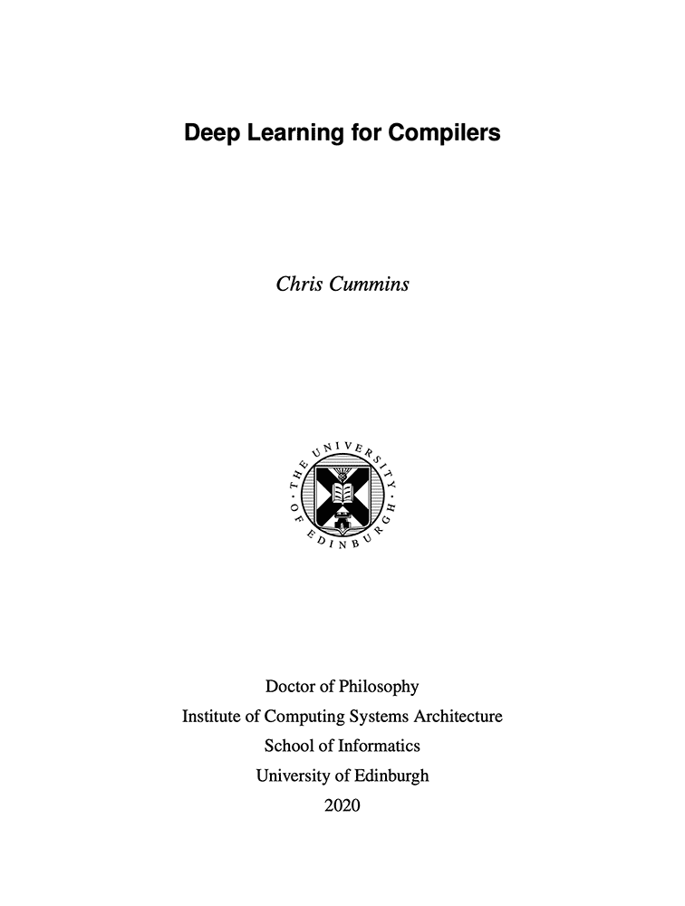

# Deep Learning for Compilers

<a href="https://chriscummins.cc/u/ed/phd-thesis.pdf" style="border: solid 1px #000">
  
</a>

```
@phdthesis{Cummins2020,
  author = {Cummins, Chris},
  school = {University of Edinburgh},
  title = {{Deep Learning for Compilers}},
  year = {2020}
}
```

[**Download PDF**](https://chriscummins.cc/u/ed/phd-thesis.pdf).

Build using:

```sh
$ bazel build //docs/thesis
```

Requires `bazel`, `pdflatex`, `biber` and `Pygments`. On macOS:

```sh
$ brew install bazel
$ brew cask install mactex
$ python -m pip install -U Pygments
```
