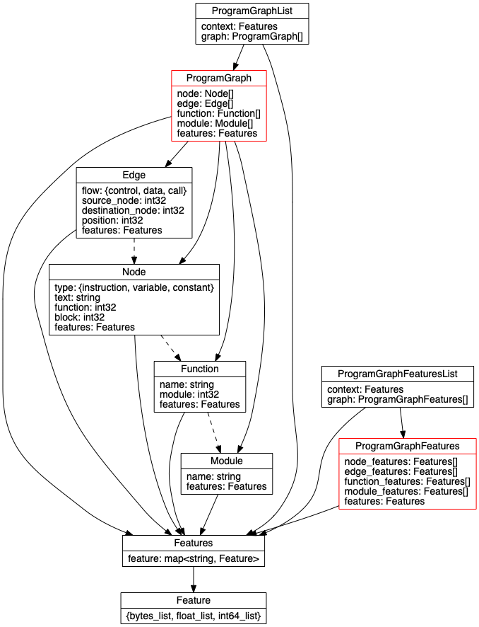

# Protocol Buffers

Protocol buffers are used for storing structured data in this project.

## Program Graphs

Program graphs are represented using a `ProgramGraph` message. This diagram shows the relationship between the various message types which make up program graphs:

